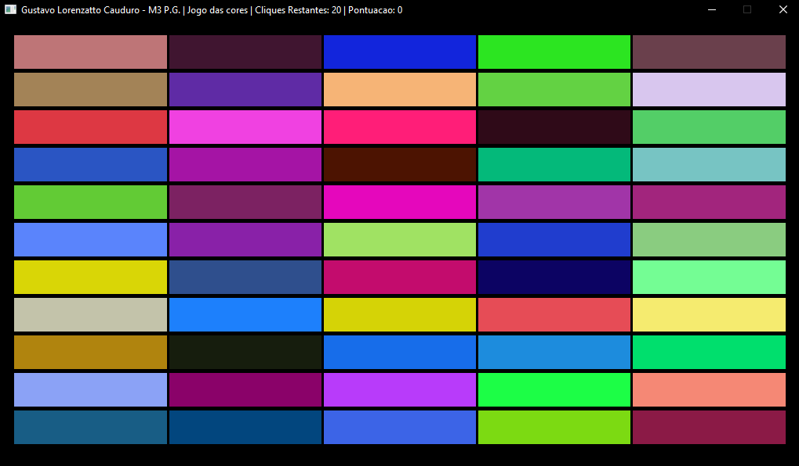

# Processamento Gráfico - M3

## Tarefa | Jogo das Cores

### Resultado

Ao executar corretamente a aplicação, o jogo será aberto, exibindo os retângulos com cores aleatórias, além da quantidade de cliques restantes e pontuação em tempo real:

